

  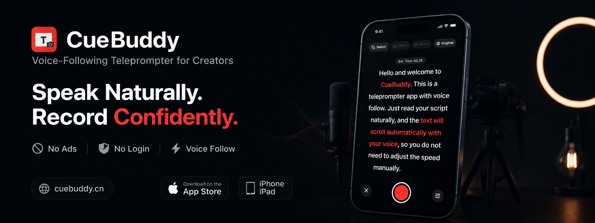

# CueBuddy

### Voice-Following Teleprompter for Creators

Speak Naturally. Record Confidently.

🌍 https://cuebuddy.cn

---

## English

Voice-Following Teleprompter for Creators

Read naturally and let the script move with your voice.

No manual speed adjustment.

No ads.

No login.

### Record Talking Videos Faster

  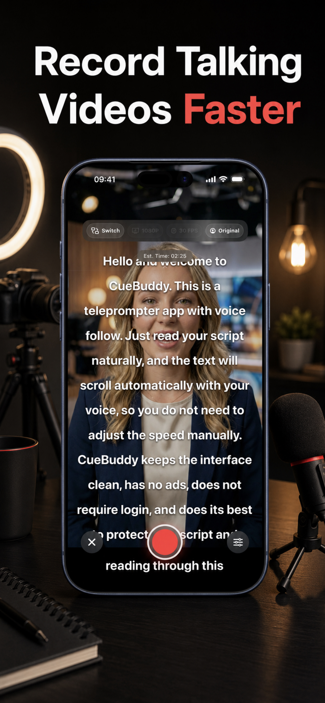

### Voice Follow Keeps Up

  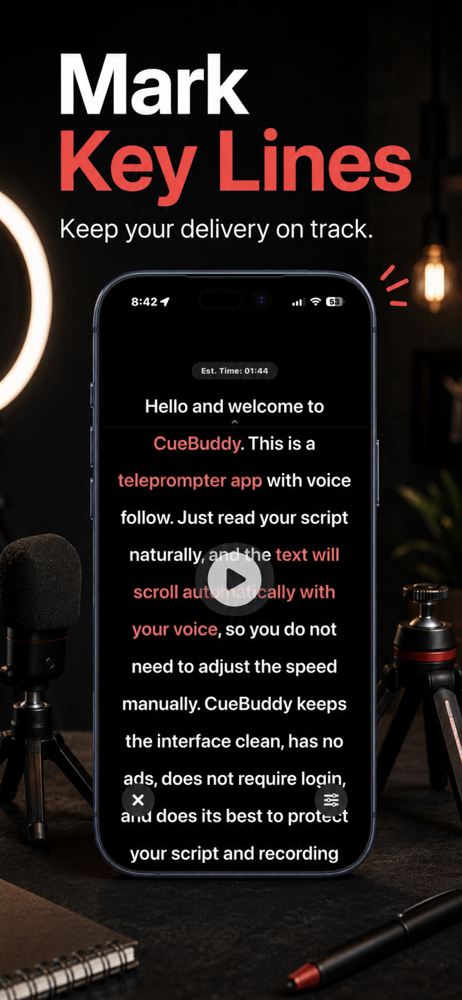

### Floating Prompt Anywhere

  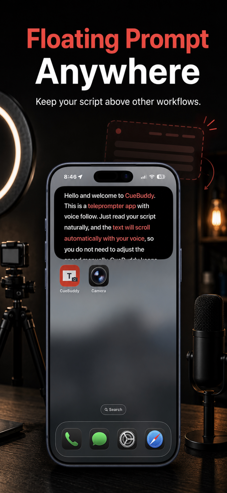

### No Ads. No Login.

  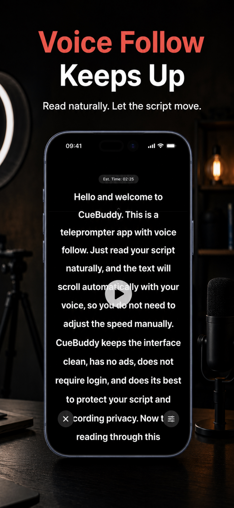

### Mark Key Lines

  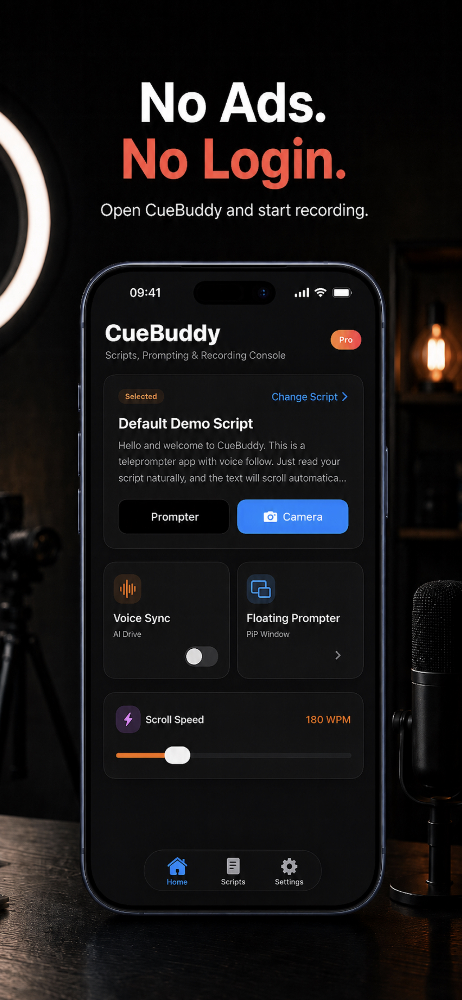

---

## Website

https://cuebuddy.cn

---

## Official Accounts

Instagram:
https://www.instagram.com/cuebuddy.app

YouTube:
https://www.youtube.com/@CueBuddy-APP

---

🇨🇳 点击展开中文介绍 (Click to expand Chinese)

 

# 中文

## 随身提词 · 语音跟随提词器

让提词器跟随你的声音滚动。

无需手动调速。

自然朗读即可。

### 更快录制口播视频

  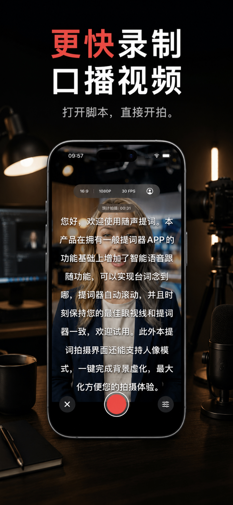

### 语音跟随朗读节奏

  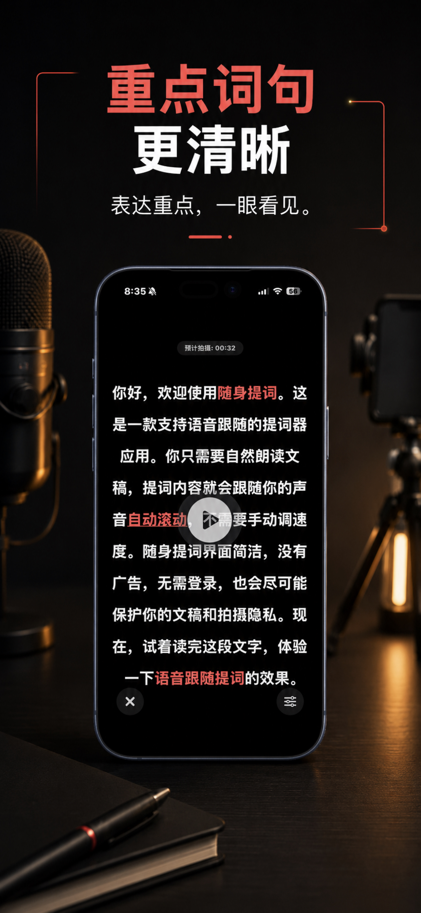

### 悬浮提词更灵活

  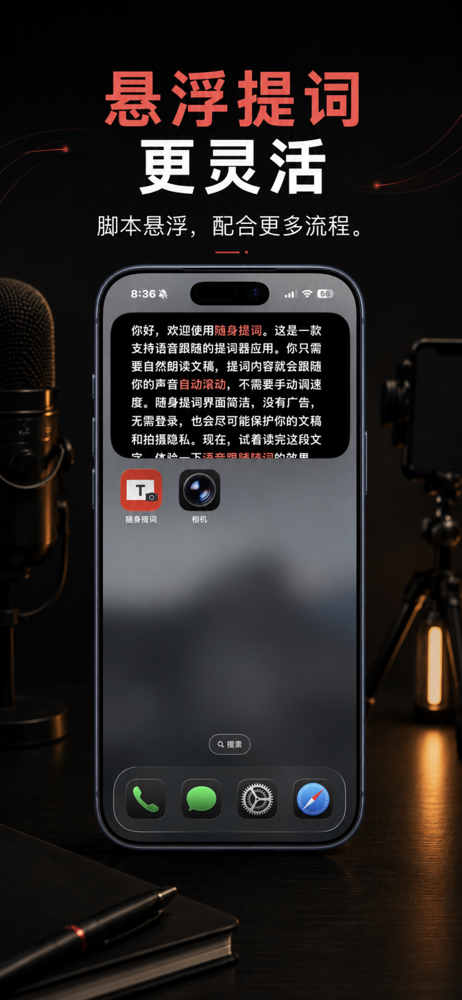

### 无广告 · 无需登录

  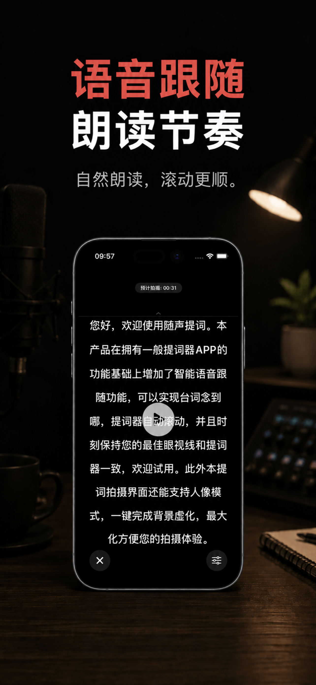

### 重点词句更清晰

  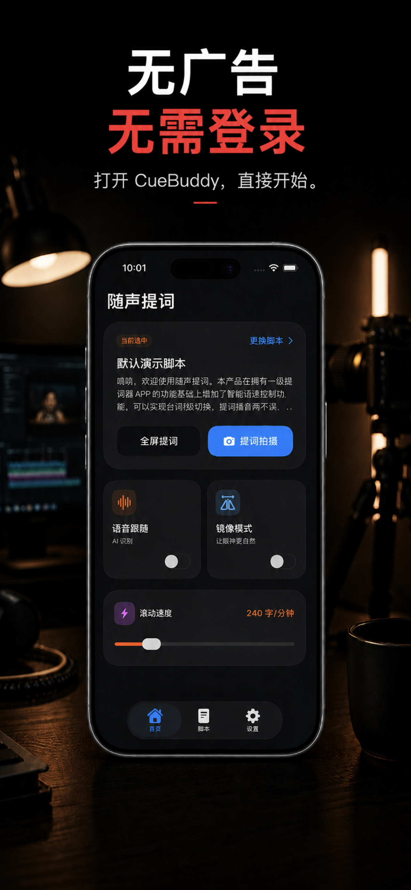

---

## 官网

https://cuebuddy.cn

---

## 官方账号（中国）

小红书：
https://xhslink.com/m/8rRGVxuSaQz

微博：
https://weibo.com/u/8440011536

抖音：
https://v.douyin.com/j0Jj3qkH2Es

